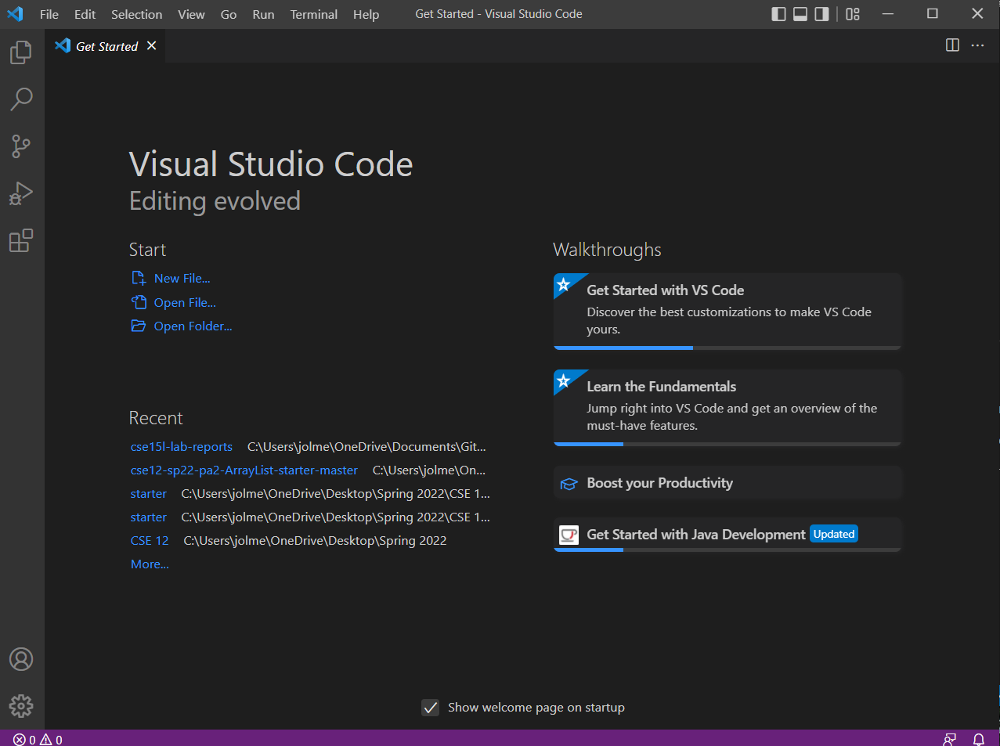
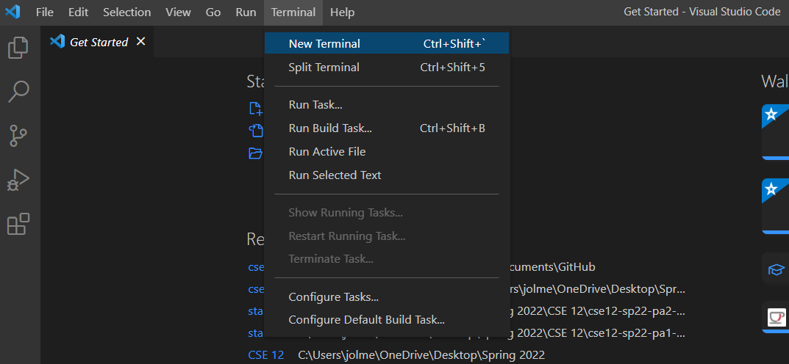
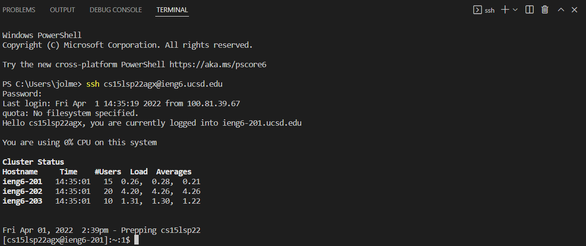
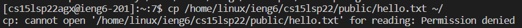
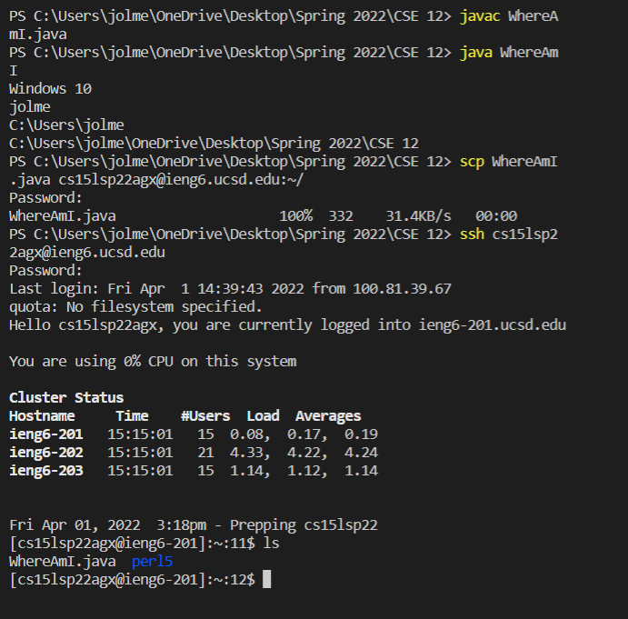
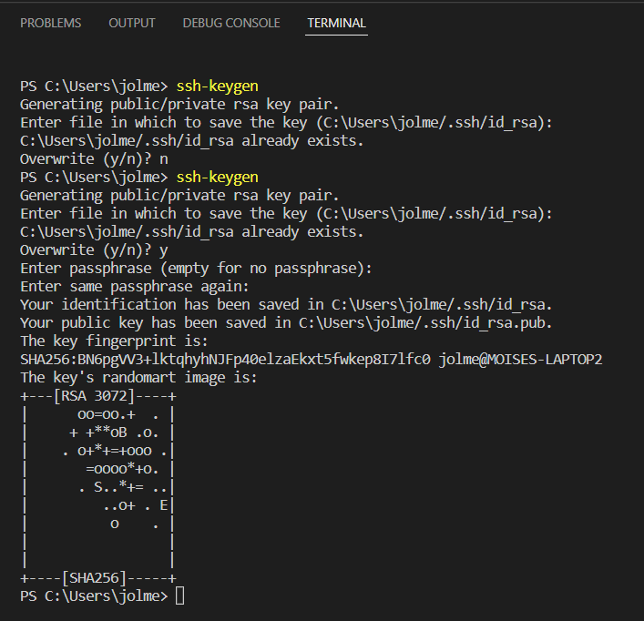
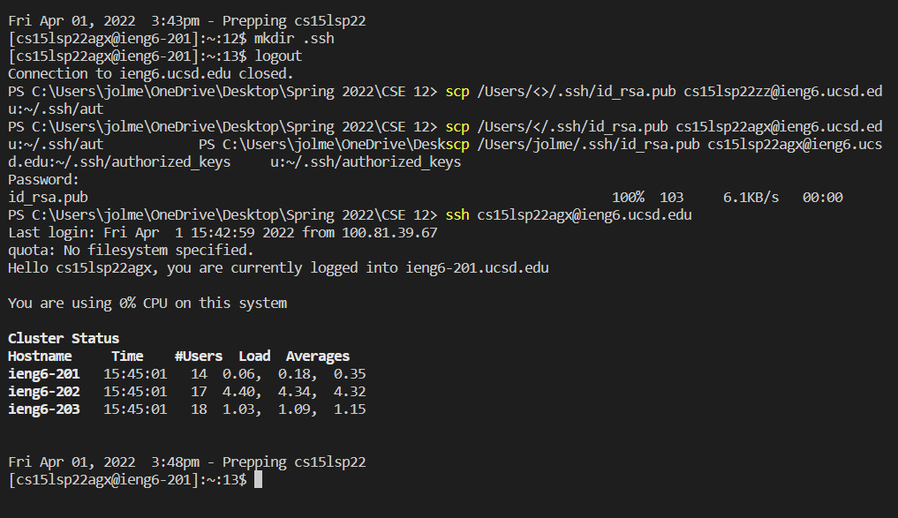
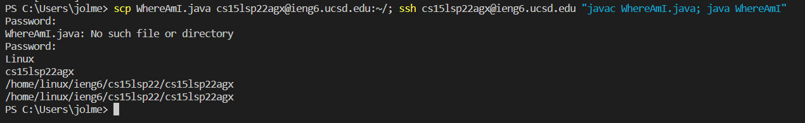

# Lab Report 1

This is a tutorial showing how I logged into a course specific account on ieng6.

## Step 1: Installing Visual Studio Code (VS Code) 

- First, I went to the [VS Code](https://code.visualstudio.com) website and downloaded the version that correlated to my computer (i.e Windows, MacOS, Linux).

- Once it was installed, I opened VS Code and my window looked like this:

    
- VS Code might look different because it has various color schemes, styles, and themes.

## Step 2: Remotely Connecting

- After I successfully downloaded VS Code, in order to connect remotely, since I am a Windows user, I downloaded [OpenSSH](https://docs.microsoft.com/en-us/windows-server/administration/openssh/openssh_install_firstuse) and followed the instructions on the linked attached.  

- Once OpenSSH was successfully downloaded, I went back to VS Code and I opened a new terminal, which I did by going to the toolbar in VS Code and pressing terminal, then pressing new terminal (Refer to the picture below).

- After I opened the new terminal, I typed in the following command: 

    $ ssh cs15lsp22agx@ieng6.ucsd.edu

    and then it asked for my password, but it did not show me my password (which I was confused with at first), once I figured it was normal for security purposes, it showed me my last login, my ip address, and I got a message that told me I was logged in and showed me my cluster status (refer to picture below).

- Note the "agx" part from above is unique to each student, so I went to the [Account Lookup Tool](https://sdacs.ucsd.edu/~icc/index.php)  and l looked up my username.

## Step 3: Trying Some Commands

- Once I was logged in, I ran the commands cd, ls -lat, ls-a, pwd, mkdir, and cp. 
- Once I understood what each command did, I tried copying a file, hello.txt, from another cs15l22 account that was not mine using the cp command 
- I got a permision denied message (refer to the picture below) because it was not my account.

## Step 4: Moving Files with scp

- After running a few commands, I created a file called WhereAmI.java to move it over to SSH. WhereAm.java looks like this:

    class WhereAmI {

        public static void main(String[] args) {
            System.out.println(System.getProperty("os.name"));
            System.out.println(System.getProperty("user.name"));
            System.out.println(System.getProperty("user.home"));
            System.out.println(System.getProperty("user.dir"));
        }
    }

- Once this file was created I compiled it using javac and java, then ran the command: 

  scp WhereAmI.java cs15lsp22agx@ieng6.ucsd.edu:~/, which then asked me for my password again. 
- Then I logged back into ssh and ran "ls" in which the file WhereAmI.java was listed in my home directory (refer to picture below).

## Step 5: Setting an SSH Key

- Next, in order to save the time it takes logging in and logging out constantly, I set up an SSH key, by first running the command "ssh-keygen", typed in y, then pressed enter twice so that I did not make a passphrase, which then generated the files public key and private key and I got this output:

- Next I copied the public key to the .ssh directory by doing the following in my terminal:

    ssh cs15lsp22zz@ieng6.ucsd.edu

    *Enter Password*

    *now on server*

    mkdir .ssh

    *logout using ctrl d or typing in exit*

    back on client

    scp /Users/molmedo/.ssh/id_rsa.pub cs15lsp22agx@ieng6.ucsd.edu:~/.ssh/authorized_keys

- Once I did this, I logged in again without a password (refer to picture below).

## Step 6: Optimizing Remote Running

- Now that I facilitated logging into the ssh, among many other shortcuts I learned, to make the time it takes to make a local edit to WhereAmI files more effecient, I did the following command in one line:

    scp WhereAmI.java cs15lsp22agx@ieng6.ucsd.edu:~/;  
    ssh cs15lsp22agx@ieng6.ucsd.edu "javac WhereAmI.java; java WhereAmI"

- When I ran this, it ask me for my password twice and I got this output:

- This command showed me the server information and the username, which was the purpose of WhereAmI.java.

