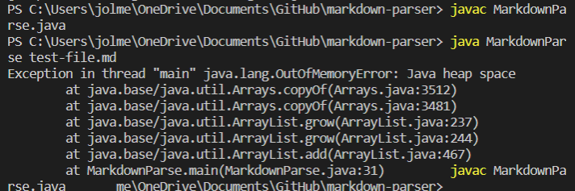
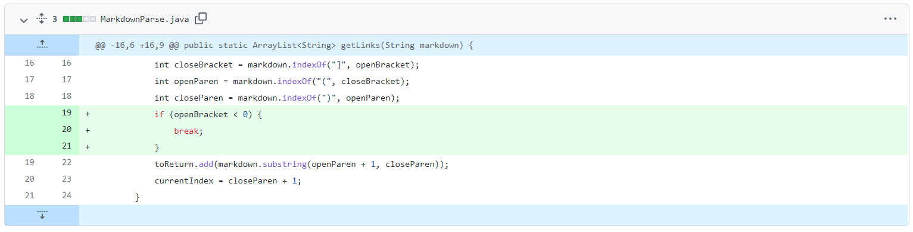
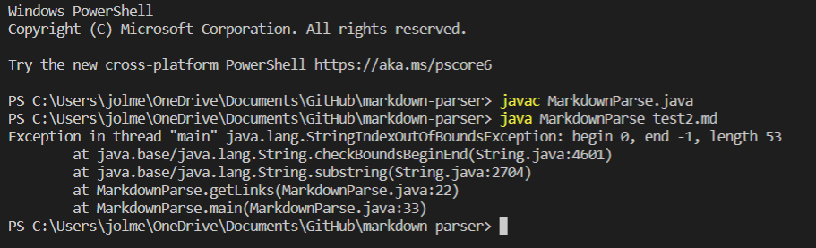
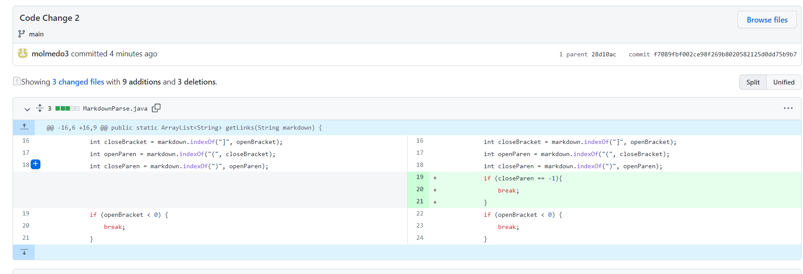
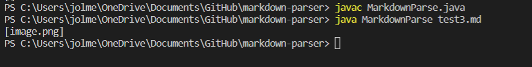
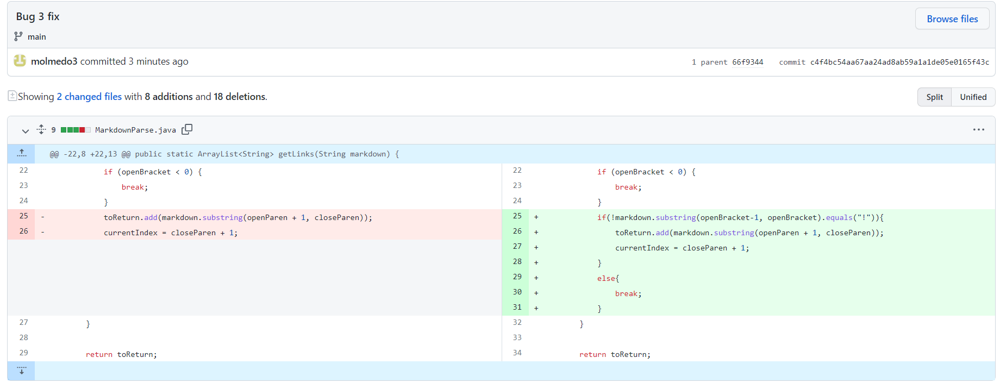

# Lab Report 2

This lab will show code changes made to the file [MarkdownParse.java](https://github.com/nidhidhamnani/markdown-parser/blob/main/MarkdownParse.java) to fix bugs that were found.

## Code Change 1
This code change was made as a result of the output when testing the file, [test-file.md](https://raw.githubusercontent.com/molmedo3/markdown-parser/main/test-file.md). This was the sympton caused by the test file:

To fix this, the following changes were made to the code:

The sympton, which was that the heap ran out of memory due to an infinite loop, was caused by the failure-inducing input, the file test-file.md, becuase it had an extra line in it causing the storing of indexes to be incorrect, because there were no brackets or parentheses found in the empty line. The error, or the bug in the code was that it did not account for any possible characters after the closing parenthesis, causing the indexes to be stored incorrectly.

## Code Change 2

The next change made was made as a result of the output when the file, [test2.md](https://raw.githubusercontent.com/molmedo3/markdown-parser/main/test2.md) was tested. This was the symtpon:

To resolve this, the following changes were made to the code:

The symptom was an index out of bounds error, resulting from the missing parentheses in the links in the test2 file (the failure-inducing input).The bug was that the code did not account for any cases in which their were no parentheses, which provoked the sympton.

## Code Change 3

This code change was provoked by the output when the [test3](https://raw.githubusercontent.com/molmedo3/markdown-parser/main/test3.md) file was tested. This was the sympton:

Although there is not a compiler or runtime error, the output was incorrect. To fix this the following changes were made:

This sympton was caused by a bug in the code, which does not check whether it is a link or an image. The failure-inducing input, the test3 file, only contained an image reference, and since the code did not check whether there was a link or image, it caused the image reference to be added to the list that was returned by the getLinks method.

**Note**: I had to redo lab 3 because my partner and I did not finish and since I had a different partner for lab 4, I had a intersection with files and such, so I redid lab 3. 
Here is a link to the commits I made:

[Commit Link](https://github.com/molmedo3/markdown-parser/commits/main)

The only relevant commits for this lab report are those made afterthe "Update to Original" commit.